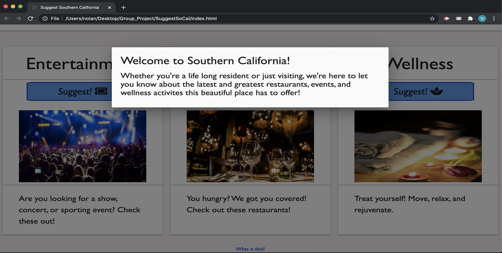
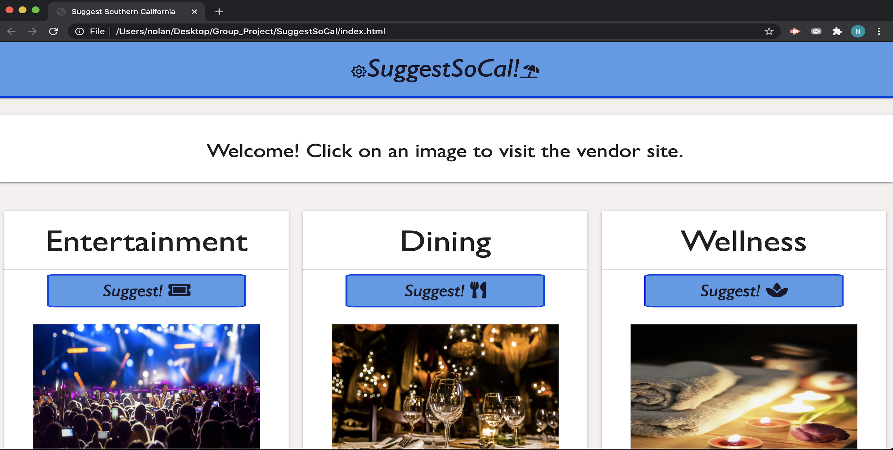
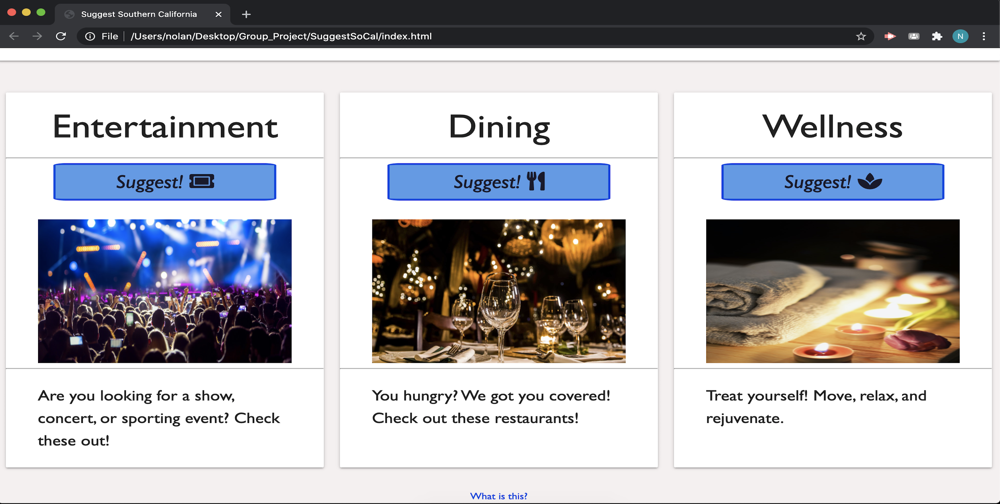

# SuggestSoCal

# Website
The purpose of this webpage is to display the best wellness deals, events, and restaurant suggestions within the southern California region.

This projects features one html page linked to a JS and a CSS page:

The website contains a:

Header title with the project title.

A modal pop-up to explain the website function.

Three cards with the categories: Entertainment, Dining, Welness. 

Within the cards are buttons that once the user clicks on, will generate deals or events within the category they are in.

This site has been formatted for handset devices including, iphone, android and most responsive web browsers.

## Getting started and deployment

This site can be accessed by clicking the link below:

https://nolanws1.github.io/SuggestSoCal/

## Built With
* HTML
* CSS
* JAVASCRIPT
* Materialize
* J-Query
* Font-awesome

## Created by

Jackie Perez / UCR Extension Program Coding Bootcamp Student
Thomas Michell / UCR Extension Program Coding Bootcamp Student
Edgar Gonzalez / UCR Extension Program Coding Bootcamp Student
Rudi Kraeher / UCR Extension Program Coding Bootcamp Student
Nolan Sanchez / UCR Extension Program Coding Bootcamp Student

## Screenshots

